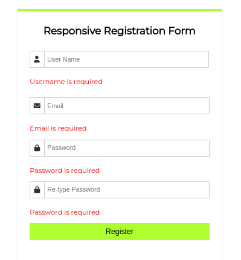
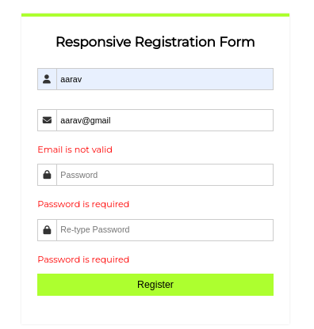
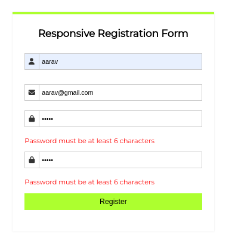
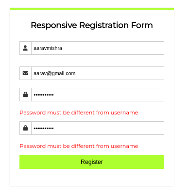

# form-validation

Form validation in React using useState & useEffect.

## Installation & Usage

Install and use form-validation with git

```bash
  git clone https://github.com/aaaravv/form-validation.git
  cd form-validation && npm i && npm start
```

> Note: Make sure you have nodejs and npm installed.

## Screenshots

<div align="center">




</div>

## Feedback

If you have any feedback, please reach out to me at aaravmishra619@gmail.com
